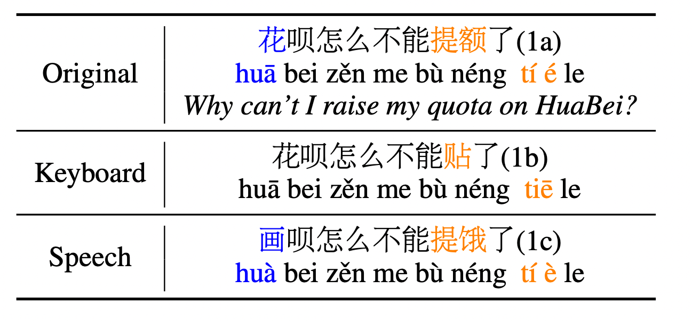

# READIN: A Chinese Multi-Task Benchmark with Realistic and Diverse Input Noises

## Introduction


READIN is a Chinese multi-task benchmark with realistic and diverse input noises. Specifically, we consider two types of noises: keybaord input noises and speech input noises. We present an illsutrative example below. 



## Data

You can access all data from this Google Driver [link](https://drive.google.com/file/d/1X5Bw_dCN8lrzM1PUYB0aw83iG22ClXJZ/view?usp=sharing).

## Models

- Classification: RoBERTa-wwm and MacBERT
- Machine translation: mBART50
- SQL-to-text: DG-SQL

## Requirements

- Python 3.9.13
- PyTorch 1.13.1
- Transformers 4.26.0
- `cuda.is_available() == True`

> Might work with other versions of the above packages, but not tested.

## Training

All code are placed in the `src` folder. The python codes that start with `train_` are used to train the models. Example commands for can be found in the bash scripts under the `scripts` subfolder. For instance, for AFQMC training, run the following in the `src` folder:

```bash
python3 train_afqmc_bert.py \
    --model_path hfl/chinese-macbert-base \
    --output_dir "results/afqmc/macbert" \
    --train_dir path/to/data \
    --test_dir path/to/data \
    --mode train_test \
    --num_epochs 6 \
    --batch_size 8 \
    --grad_acc_steps 32 \
    --lr 5e-5 \
    --log_interval 80
```

> For testing or training only, set `--mode test` or `--mode train` respectively.

For testing mBART50:

```bash
python3 test_mbart.py
```


### Citation

If you find our work useful, please consider citing this paper.
```bib
@article{si-2023-readin,
    title = "{READIN: A Chinese Multi-Task Benchmark with Realistic and Diverse Input Noises}",
    author = "Chenglei Si and Zhengyan Zhang and Yingfa Chen and Xiaozhi Wang and Zhiyuan Liu and Maosong Sun",
    journal = "arXiv",
    year = "2023"
}
```

