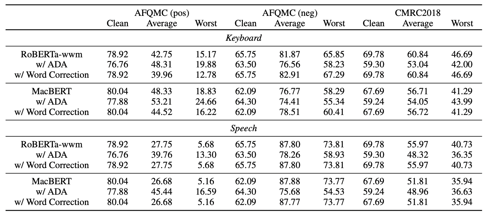
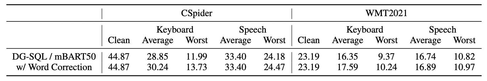
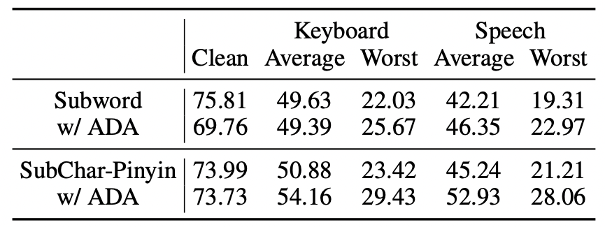

# READIN: A Chinese Multi-Task Benchmark with Realistic and Diverse Input Noises

## Introduction


READIN is a Chinese multi-task benchmark with realistic and diverse input noises. Specifically, we consider two types of noises: keybaord input noises and speech input noises. We present an illsutrative example below. 


We cover four datasets corresponding to four different tasks: AFQMC (paraphrase identification), CMRC2018 (machine reading comprehension), CSpiser (semantic parsing), WMT2021 (machine translation). More dataset statistics and how we collected the noisy test sets can be found in the paper.

## Data

You can access all data from this Google Driver [link](https://drive.google.com/file/d/1X5Bw_dCN8lrzM1PUYB0aw83iG22ClXJZ/view?usp=sharing).

Once you download and unzip the above file, you will find three folders corresponding to three versions of the benchmark: 
1) the clean version with no input noises; 
2) the keyboard version with keyboard input noises; 
3) the speech version with speech input noises. 

For fair evaluation and comparison, you should train and perform hyper-parameter tuning on the clean data and test on the noisy versions to test your models' robustness, unless you want to incorporate noisy data in your training for data augmentation (which is also described as a baseline in the paper).


## Benchmark Results

We list below our benchmark results for the baseline models and training methods that we tried in our paper. 

### Models

- Classification: RoBERTa-wwm and MacBERT
- Machine translation: mBART50
- SQL-to-text: DG-SQL

### Methods

Apart from standard supervised finetuning (i.e., Empirical Risk Minimization), we also explore three other robust training methods:

1) Adversarial Data Augmentation (ADA): Adding noisy data in the finetuning process;
2) Word Correction: Applying a character-level correction model to pre-preprocess the noisy test sets;
3) SubChar Tokenization: New tokenization methods from [(Si et al., 2021)](https://arxiv.org/abs/2106.00400)

### Results 

We present the full set of experiment results below for easir comparision with future work. 








## Code 

### Requirements

- Python 3.9.13
- PyTorch 1.13.1
- Transformers 4.26.0
- `cuda.is_available() == True`

> Might work with other versions of the above packages, but not tested.

### Training and Inference

All code are placed in the `src` folder. The python codes that start with `train_` are used to train the models. Example commands for can be found in the bash scripts under the `scripts` subfolder. For instance, for AFQMC training, run the following in the `src` folder:

```bash
python3 train_afqmc_bert.py \
    --model_path hfl/chinese-macbert-base \
    --output_dir "results/afqmc/macbert" \
    --train_dir path/to/data \
    --test_dir path/to/data \
    --mode train_test \
    --num_epochs 6 \
    --batch_size 8 \
    --grad_acc_steps 32 \
    --lr 5e-5 \
    --log_interval 80
```

> For testing or training only, set `--mode test` or `--mode train` respectively.

For testing mBART50:

```bash
python3 test_mbart.py
```


## Citation

If you find our work useful, please consider citing this paper.
```bib
@article{si-2023-readin,
    title = "{READIN: A Chinese Multi-Task Benchmark with Realistic and Diverse Input Noises}",
    author = "Chenglei Si and Zhengyan Zhang and Yingfa Chen and Xiaozhi Wang and Zhiyuan Liu and Maosong Sun",
    journal = "arXiv",
    year = "2023"
}
```

If you have any questions, feel free to post them on Github issues or contact the authors (`sichenglei1125@gmail.com`). 

